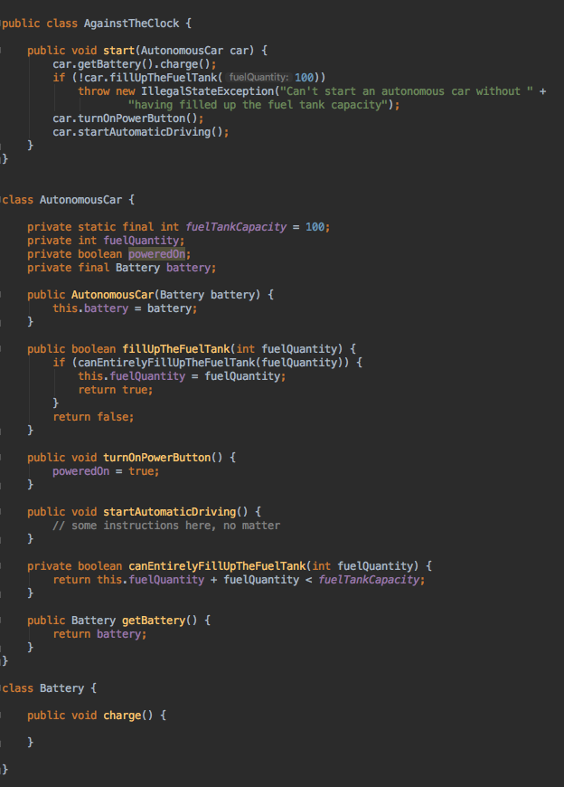

# Against The Clock

This coding challenge is a refactoring exercise with legacy code for Software Craftsmen for training purposes. An autonomous car has an hybrid motor and is engaged in a race against the clock. The exercise was originally created and proposed by [Michaël Azerhad](https://gist.github.com/mica16/dfb61dcd77698f5c192e0f38aba94eac) and starts with identifying code smells that break some object-oriented concepts.

My solution uses [TestAsYouThink](http://testasyouthink.org), a fluent testing API.
